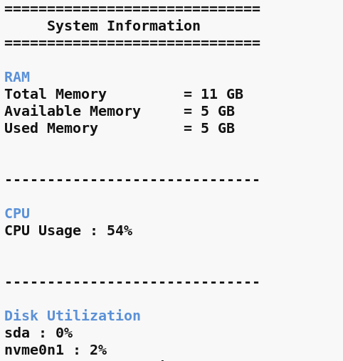

# System Information Display


<h2 align="center">Preview</h2>

<p align="center">
  
</p>

A lightweight Linux system monitoring tool written in **C++** that gathers real-time system information directly from the Linux kernel's `/proc` filesystem.

The goal of this project is to understand how Linux exposes system information rather than relying on external utilities such as `top`, `htop`, or `free`.

---

## Features

- CPU Utilization
- Memory (RAM) Utilization
- Disk Utilization
- Modular C++ Design
- Built using Makefile
- Reads data directly from the Linux `/proc` filesystem

---

## Project Structure

```
SystemInfoDisplay/
│
├── include/
│   ├── cpuInfo.h
│   ├── memInfo.h
│   ├── diskUtilization.h
│
├── src/
│   ├── cpuInfo.cpp
│   ├── memInfo.cpp
│   ├── diskUtilization.cpp
│
├── build/
├── Makefile
└── main.cpp
```

---

# How It Works

Linux exposes most runtime system statistics through the virtual `/proc` filesystem.

Instead of executing shell commands, this project reads and parses files inside `/proc` to obtain system information.

Current implementation uses

| Component | Source |
|-----------|--------|
| CPU Usage | `/proc/stat` |
| Memory Usage | `/proc/meminfo` |
| Disk Utilization | `/proc/diskstats` |

---

# CPU Utilization

CPU statistics are obtained from

```
/proc/stat
```

Example

```text
cpu  130 20 80 1000 10 5 15 0 0 0
     |   |  |   |    | | | |
     |   |  |   |    | | | +-- guest
     |   |  |   |    | | +---- steal
     |   |  |   |    | +------ softirq
     |   |  |   |    +-------- irq
     |   |  |   +------------- idle
     |   |  +----------------- system
     |   +-------------------- nice
     +------------------------ user
```

These values **do not represent current CPU usage**.

Each field stores the **total CPU time accumulated since system boot**, measured in **clock ticks (jiffies)**.

---

## Why Two Readings?

Because `/proc/stat` contains cumulative counters, one snapshot cannot determine CPU usage.

Instead,

1. Read `/proc/stat`
2. Wait for a short interval (typically 1 second)
3. Read it again
4. Compare both readings

Only the difference between the two snapshots represents CPU activity during that interval.

---

## Calculation

Idle time

```text
Idle = idle + iowait
```

Non-idle time

```text
NonIdle =
user +
nice +
system +
irq +
softirq +
steal
```

Total CPU time

```text
Total = Idle + NonIdle
```

Difference

```text
TotalDiff = Total₂ − Total₁

IdleDiff = Idle₂ − Idle₁
```

Final formula

```text
CPU Usage (%) =
((TotalDiff − IdleDiff) / TotalDiff) × 100
```

This gives the percentage of time the CPU spent doing useful work during the sampling interval.

---

# Memory (RAM) Utilization

Memory information is read from

```
/proc/meminfo
```

Example

```text
MemTotal:       16348920 kB
MemFree:         2018420 kB
MemAvailable:    8423168 kB
Buffers:          321412 kB
Cached:          2812340 kB
```

---

## Why MemAvailable?

Linux aggressively uses unused RAM as cache.

Therefore

```text
Used Memory ≠ MemTotal − MemFree
```

because cached pages can be reclaimed whenever applications need memory.

The kernel already estimates reclaimable memory through

```
MemAvailable
```

which provides a much better representation of usable memory.

---

## Calculation

```text
Used Memory = MemTotal − MemAvailable
```

```text
Memory Usage (%) =
((MemTotal − MemAvailable)
/ MemTotal) × 100
```

---

# Disk Utilization

Disk statistics are obtained from

```
/proc/diskstats
```

The implementation uses the field

```
Time spent doing I/O (milliseconds)
```

which stores the total time the device has been busy since boot.

Like CPU statistics, this value is cumulative.

---

## Why Two Readings?

```
Busy Time = t₁
```

Wait one second.

```
Busy Time = t₂
```

Only the difference

```text
ΔIO Time = t₂ − t₁
```

represents the amount of time the disk was actually busy during that interval.

---

## Calculation

```text
Disk Utilization (%) =
(ΔIO Time / ΔElapsed Time) × 100
```

For a one-second sampling interval,

```text
Disk Utilization (%) =
((t₂ − t₁) / 1000) × 100
```

If

```text
ΔIO Time = 920 ms
```

then

```text
Disk Utilization = 92%
```

meaning the disk was busy servicing I/O requests for 92% of the measured interval.

---

# Build

```bash
make
```

Run

```bash
./sysInfoDisplay
```

Clean

```bash
make clean
```

---

# Concepts Learned

- Linux `/proc` filesystem
- Parsing virtual files
- CPU scheduling statistics
- Jiffies and kernel counters
- Memory management
- Disk I/O statistics
- C++ file handling
- Makefile
- Modular programming

---

# Future Improvements

- Network statistics
- Process monitoring
- Multi-core CPU statistics
- Temperature monitoring
- Colored terminal UI
- ncurses interface
- Threaded data collection


---

## Progress

```text
v1  ██████████ 100% ✔
v2  ███░░░░░░░  In Progress...

